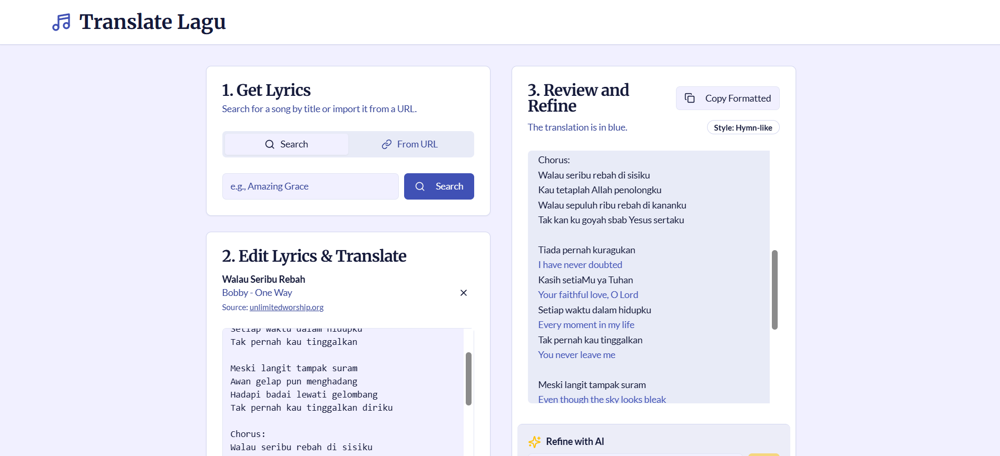

# Translate Lagu

An AI-powered application designed to seamlessly translate song lyrics between English and Indonesian. This tool helps users not only get accurate translations but also understand the nuance and style of the original text, with features to refine and clean lyrics for the best results.


*Replace the placeholder with a screenshot of the running application.*

---

## Features

- **AI-Powered Translation**: Leverages Google's Gemini models via Genkit to provide nuanced, line-by-line translations that capture the style of the song.
- **Dynamic Lyric Sourcing**:
    - **Search by Title/Artist**: Find any song by searching for its title or artist. The app uses the Brave Search API to find reliable sources online.
    - **Import from URL**: Directly paste a URL to a lyrics page to extract the song text.
- **Intelligent Lyric Extraction**: An AI flow analyzes the content of a webpage to intelligently identify and extract just the song lyrics, filtering out website chrome, ads, and other irrelevant text.
- **Lyric Cleanup Tool**: A one-click "Clean Up" button that programmatically removes structural tags (like `[Verse]`, `[Chorus]`) and de-duplicates repeated sections, preparing the text for a cleaner translation.
- **AI-Powered Refinement**: After an initial translation, you can provide a natural language prompt (e.g., "Make it more poetic," "Use more formal language") to have the AI refine the translation.
- **Interactive Translation Review**:
    - The translated text is displayed interleaved with the original lyrics for easy comparison.
    - **Copy All**: A single button to copy the entire translated work.
    - **Copy per Block**: Simply click on any lyric block (a verse, chorus, etc.) to copy just that section to your clipboard.
- **Responsive UI**: Built with ShadCN UI and Tailwind CSS for a clean, modern, and responsive user experience on any device.

---

## How It Works

The application uses a series of Genkit AI flows to orchestrate a sophisticated translation pipeline:

1.  **Search**: When a user searches for a song, a server action calls the `searchSongCandidates` flow. This flow queries the **Brave Search API** and then uses an AI prompt to analyze the search results and identify the most likely song candidates (title and artist).
2.  **Lyric Fetching**: Once a song is selected, the `getLyricsForSong` flow is triggered. It performs another targeted Brave Search for lyrics, uses an AI prompt to select the most reliable URLs from the results, and then attempts to fetch content from them one by one.
3.  **Extraction**: The raw HTML content from the best URL is passed to the `extractFromContentPrompt`. This AI-powered step reads the messy text and extracts only the clean `songTitle`, `artist`, and `lyrics`.
4.  **Translation**: The `translateLyrics` flow takes the clean lyrics. It uses a detailed prompt to instruct the AI to analyze the song's nuance, determine a `translationStyle`, and perform a line-by-line translation, interleaving the result with the original text.
5.  **Refinement**: If the user provides a refinement prompt, the `refineTranslation` flow is called. It takes the original text, the current translation, and the user's instructions to generate an improved version.
6.  **Client-Side Interaction**: The entire experience is managed on a single page using React, with Server Actions handling all communication with the backend AI flows. State is managed with React hooks (`useState`, `useTransition`) for a smooth, non-blocking UI.

---

## Tech Stack

- **Framework**: [Next.js](https://nextjs.org/) (App Router, Server Components)
- **AI Orchestration**: [Genkit](https://firebase.google.com/docs/genkit)
- **AI Models**: Google Gemini
- **Web Search**: [Brave Search API](https://brave.com/search/api/)
- **UI Components**: [ShadCN UI](https://ui.shadcn.com/)
- **Styling**: [Tailwind CSS](https://tailwindcss.com/)
- **Language**: [TypeScript](https://www.typescriptlang.org/)
- **Forms**: React Hook Form
- **Schema Validation**: Zod

---

## Getting Started

To run this project locally, follow these steps.

### Prerequisites

- [Node.js](https://nodejs.org/) (version 20 or later)
- An API key from [Brave Search](https://brave.com/search/api/)
- A Google AI API key enabled for the Gemini models. Follow the setup instructions for [Genkit with Google AI](https://firebase.google.com/docs/genkit/get-started?platform=other).

### Installation & Setup

1.  **Clone the repository:**
    ```bash
    git clone <repository-url>
    cd <repository-directory>
    ```

2.  **Install dependencies:**
    ```bash
    npm install
    ```

3.  **Set up environment variables:**
    Create a file named `.env` in the root of your project and add your API keys:
    ```
    # Get your key from https://brave.com/search/api/
    BRAVE_API_KEY="YOUR_BRAVE_API_KEY"

    # Set up your Google AI API key for Genkit
    # See: https://firebase.google.com/docs/genkit/get-started?platform=other
    GOOGLE_API_KEY="YOUR_GOOGLE_AI_API_KEY"
    ```

4.  **Run the development server:**
    ```bash
    npm run dev
    ```

The application will be available at `http://localhost:9002`.

---
